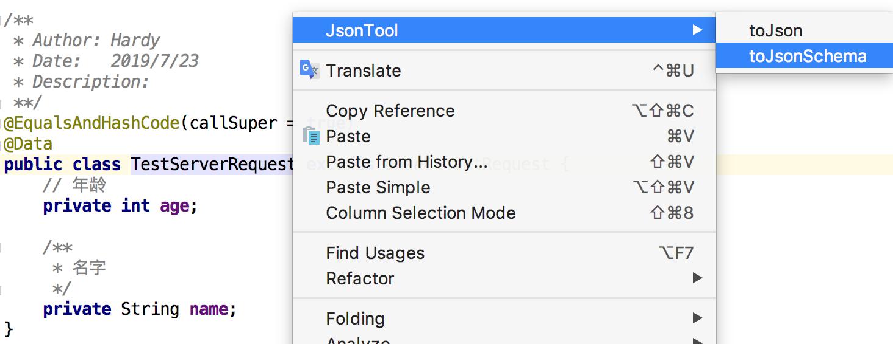

## Java Bean Tool

一个Java Bean工具, 支持将一个bean转换为Json或Json Schema




`toJson:`
```
{
  "log": {
    "ROOT_LOGGER_NAME": ""
  },
  "age": 0,
  "name": ""
}
```

`toJsonSchema:`
```
{
 "type": "object",
 "properties": {
   "age": {
     "type": "integer",
     "description": "年龄 "
   },
   "name": {
     "type": "string",
     "description": "名字"
   }
 }
}
```

### 1.0.1
- 进行`json/json schema`生成
- 支持根据注释生成字段描述
- 注: BigDecimal 生成类型为string

### 1.0.2
- bug fix

### 1.0.3
- 支持部分`javax.validation.constraints`注解
  * `@NotNull` 字段必需存在
  * `@NotBlank` 字符串必需存在，且值长度>=1
  * `@Size` 字符串长度范围
  * `@Pattern` 字符串正则
  * `@Min` 数字最小值
  * `@Max` 数字最大值
  * `@DecimalMin` 非整数类型的最小值
  * `@DecimalMax` 非整数类型的最大值
  * `@Positive` 数字>0
  * `@PositiveOrZero` 数字>=0
  * `@Negative` 数字<0
  * `@NegativeOrZero` 数字<=0

### 1.0.4
- 增加`<idea-version since-build="181.5684.4" until-build="211.5787.15"/>`
    